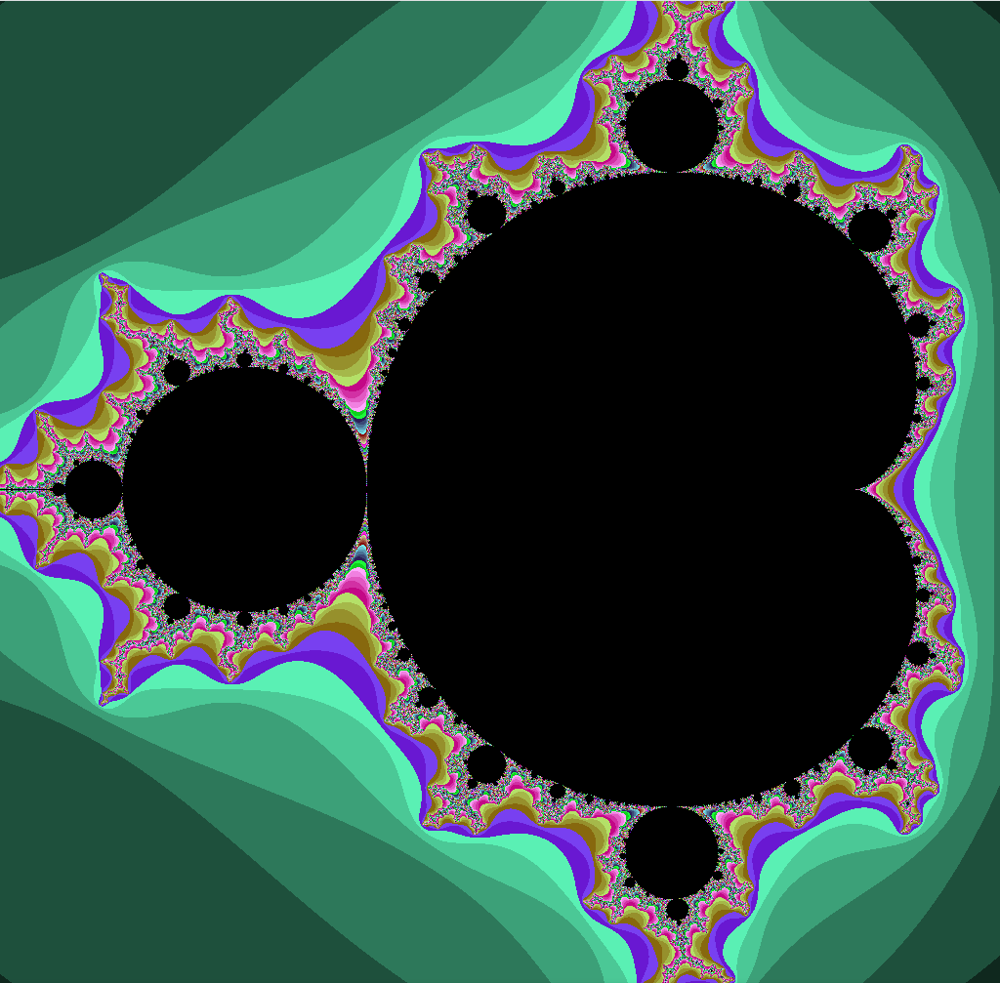

Данная работа состояла в сравнении скалярных и векторных реализаций двух алгоритмов: множество Мадельброта и наложение изображений с прозрачностью

### Mandelbrot


#### Test environment
1. CPU: AMD Ryzen 7 4800H
2. Arch Linux, GCC v12.2.1, Clang v15.0.7
3. No other apps running, only KDE + Konsole
4. CPU governor = performance
5. Process nice level = -20 (minimal)
6. 100 runs before rendering
7. Флаги сборки: `-Ofast -march=native -mtune=native -flto` (see `measures.sh` for detailed info)

#### Results
| Version | GCC | Clang |
| --- | --- | -- |
| scalar | 478 ± 0.13 ms | 459 ± 0.09 ms |
| vector    | 58 ± 0.06 ms  | 60 ± 0.07 ms |

<details>
  <summary>Полные данные измерений: </summary>

    First run:
```text
    Benchmark results (dumb::calc): 479 ± 0.736348 ms (100 iterations, GCC v12.2.1)
    Benchmark results (avx::calc): 58 ± 0.124553 ms (100 iterations, GCC v12.2.1)
    Benchmark results (dumb::calc): 459 ± 0.165074 ms (100 iterations, Clang v15.0.7)
    Benchmark results (avx::calc): 60 ± 0.103167 ms (100 iterations, Clang v15.0.7)
```
    
    Second run: 
```text
Benchmark results (dumb::calc): 478 ± 0.1328 ms (100 iterations, GCC v12.2.1)
Benchmark results (avx::calc): 58 ± 0.06315 ms (100 iterations, GCC v12.2.1)
Benchmark results (dumb::calc): 459 ± 0.0943684 ms (100 iterations, Clang v15.0.7)
Benchmark results (avx::calc): 60 ± 0.0674793 ms (100 iterations, Clang v15.0.7)
```

</details>

#### How to reproduce
0. Install Arch Linux with given compiler versions
1. Clone repo
2. run `measure.sh`
